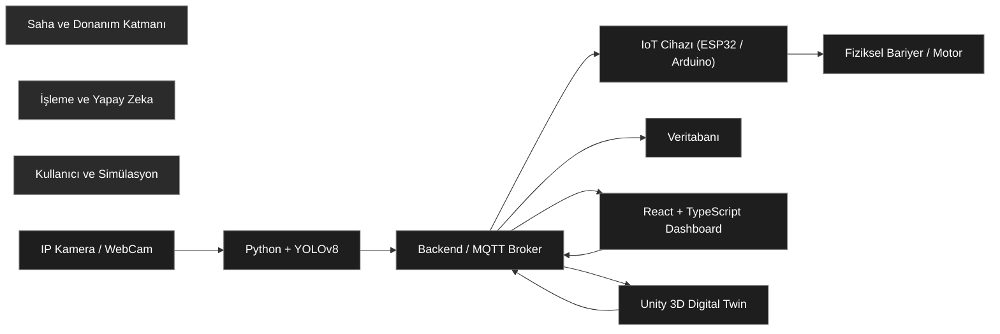

# Smart Barrier System (Akıllı Bariyer Sistemi)


**Smart Barrier System**, trafik yoğunluğunu gerçek zamanlı olarak analiz eden, fiziksel bariyerleri yöneten ve tüm süreci hem web arayüzünden hem de dijital ikiz (Unity) üzerinden takip etmeyi sağlayan entegre bir akıllı ulaşım çözümüdür.

Bu proje, özellikle yoğun saatlerde (peak hours) trafik sıkışıklığını azaltmak için karşı şeridi kullanıma açan "Akıllı Şerit" mantığını simüle eder ve uygular.

---

## Sistem Mimarisi

Sistem, sahadan gelen verilerin işlenmesi, karar verilmesi ve fiziksel/dijital ortamlara yansıtılması prensibiyle çalışır.



---

##  Demo, Ekran Görüntüleri ve Sunum

> **Not:** Bu projede sistemin çalışma mantığı iki temel bileşen üzerinden görselleştirilmiştir:  
> Web tabanlı kontrol paneli ve Unity tabanlı dijital ikiz simülasyonu.  
> Proje sunumu ve canlı web arayüzü için harici bağlantılar sağlanmıştır.

---

### 🌐 Web Dashboard & AI Tespiti

Aşağıdaki görsel, web tabanlı kontrol paneli üzerinden anlık trafik yoğunluğu takibini ve YOLOv8 tabanlı araç tespit sürecini göstermektedir.

- Gerçek zamanlı trafik yoğunluğu analizi  
- YOLOv8 ile araç tespiti ve sınıflandırma  
- Otomatik ve manuel bariyer kontrolü  
- Karar mekanizmasının görsel çıktıları  


🔗 **Web Dashboard Linki:**  
https://bursa-akilli-sehir-hackathon-projes.vercel.app/

---

### 🎮 Unity Digital Twin Simülasyonu

Aşağıdaki görsel, gerçek trafik verilerinin Unity 3D ortamında dijital ikiz (Digital Twin) yaklaşımıyla nasıl simüle edildiğini göstermektedir.

- Dinamik şerit yönetimi  
- Bariyer animasyonları  
- Senaryo ve stres testleri  
- Gerçek zamanlı veri entegrasyonu  


---

### 📊 Proje Sunumu

Projenin problem tanımı, sistem mimarisi, kullanılan teknolojiler ve elde edilen sonuçlar sunumda detaylı olarak ele alınmıştır.

- Problem tanımı ve motivasyon  
- Sistem mimarisi ve veri akışı  
- Yapay zeka modeli ve karar mekanizması  
- Demo senaryoları ve sonuçlar  

📑 **Sunum Linki:**  
https://prezi.com/view/axPSJ3i9x84WKjyZmyRa/?referral_token=-Yp1b-lnB3FN


## ✨ Özellikler

### 🧠 Yapay Zeka (Python & YOLOv8)
* Gerçek zamanlı araç tespiti ve sınıflandırma (Car, Truck, Bus).
* Şerit bazlı yoğunluk hesabı.
* Dinamik şerit yönetimi için karar mekanizması.

### 🌐 Web Arayüzü (React & TypeScript)
* Anlık trafik durumu görselleştirme.
* Bariyerlerin manuel kontrolü (Aç/Kapa/Yön Değiştir).
* Geçmiş trafik verileri ve loglar.
* Modern ve responsive UI tasarımı.

### 🎮 Simülasyon (Unity 3D)
* Gerçek dünya verilerinin 3D ortamda görselleştirilmesi (Digital Twin).
* Fiziksel bariyer kurulmadan önce senaryo testleri.
* Yapay zeka trafiği ile stres testleri.
* `BarrierController` ve `TrafficManager` senaryoları ile dinamik akış.

### 🔌 IoT & Donanım
* Servo motorlar ile bariyer kontrolü.
* Sensör verilerinin sunucuya iletilmesi (MQTT/HTTP).
* Acil durum protokolleri.

---

## 🛠️ Teknoloji Yığını (Tech Stack)

| Alan | Teknolojiler |
|---|---|
| **Yapay Zeka** | Python, YOLOv8, OpenCV, NumPy |
| **Frontend** | React, TypeScript, TailwindCSS |
| **Backend / API** | Python (Flask/FastAPI) veya Node.js |
| **Simülasyon** | Unity 3D, C# Scripting |
| **Gömülü Sistem** | C++, Arduino IDE, ESP32/ESP8266 |
| **İletişim** | MQTT, WebSocket, HTTP REST API |

---

## 🚀 Kurulum ve Çalıştırma

Proje modüler bir yapıdadır. İlgili modülü çalıştırmak için aşağıdaki adımları izleyin.

### 1. Repoyu Klonlayın
```bash
git clone [https://github.com/lutfubedel/Smart_Barrier_System.git](https://github.com/lutfubedel/Smart_Barrier_System.git)
cd Smart_Barrier_System
```

### 2. Yapay Zeka (AI) Kurulumu
```bash
cd AI_Detection  # Klasör adını projenize göre güncelleyin
pip install -r requirements.txt
python main.py
```

### 3. Web Arayüzü (Frontend) Kurulumu
```bash
cd Web_Dashboard  # Klasör adını projenize göre güncelleyin
npm install
npm start
```

### 4. IoT (Gömülü Sistem)
* `Arduino` klasöründeki `.ino` dosyasını Arduino IDE ile açın.
* Kart ayarlarınızı yapın ve kodu yükleyin.

### 5. Unity Simülasyonu
* Unity Hub'ı açın.
* `Unity_Simulation` klasörünü proje olarak ekleyin ve başlatın.

---

## 📹 Video Tanıtımı

Projenin tüm detaylarını ve çalışma mantığını anlattığım videoya aşağıdan ulaşabilirsiniz:

[](https://www.youtube.com/watch?v=VIDEO_ID_BURAYA)

---

## 🤝 Katkıda Bulunma

1.  Bu repoyu Fork'layın.
2.  Yeni bir özellik dalı (branch) oluşturun (`git checkout -b feature/YeniOzellik`).
3.  Değişikliklerinizi commit yapın (`git commit -m 'Yeni özellik eklendi'`).
4.  Branch'inizi pushlayın (`git push origin feature/YeniOzellik`).
5.  Bir Pull Request oluşturun.

---

## 📧 İletişim

Geliştirici: **Lütfü Bedel**
GitHub: [lutfubedel](https://github.com/lutfubedel)

*Bu proje MIT Lisansı ile lisanslanmıştır.*
